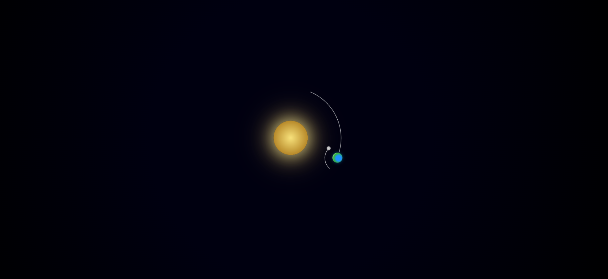

## 🌌 Mini Sistema Solar — HTML & CSS Animation

> Simulação visual minimalista do sistema solar utilizando apenas HTML5 e CSS3. Animações orbitais puras, sem JavaScript.

---

📸 Preview

## ✨ Funcionalidades

☀️ Sol central com efeito de brilho e gradiente

🌍 Terra orbitando o Sol com rotação contínua

🌕 Lua orbitando a Terra com velocidade superior

🌌 Fundo espacial minimalista

🎞️ Animações 100% feitas com @keyframes

🚫 Nenhum uso de JavaScript

## 🛠️ Tecnologias
Camada	Tecnologia
Estrutura	HTML5
Estilização	CSS3
Animação	CSS @keyframes
Transformações	rotate() + transform-origin

## 📁 Estrutura do Projeto
Sistema-Solar/
│
├── index.html      # Estrutura dos corpos celestes
└── style.css       # Estilização e animações orbitais

## 🧠 Como Funciona

O movimento orbital é criado aplicando a animação ao container da órbita, e não diretamente ao planeta.

## Exemplo simplificado:

@keyframes orbit {
  from { transform: rotate(0deg); }
  to   { transform: rotate(360deg); }
}

A órbita gira continuamente com:

animation: orbit 10s linear infinite;

Isso cria a ilusão de movimento circular suave e contínuo.

## 🚀 Como Executar
1. Clone o repositório
git clone https://github.com/MuriloOz/Sistema-Solar.git
cd Sistema-Solar
2. Abra o projeto

Basta abrir o arquivo:

index.html

A animação iniciará automaticamente no navegador.

## 🎯 Objetivo do Projeto

Este projeto foi desenvolvido para:

📚 Praticar animações avançadas em CSS

🧩 Trabalhar posicionamento absoluto e hierarquia

🎨 Explorar efeitos visuais com gradientes e sombras

💼 Compor portfólio front-end

🔮 Possíveis Melhorias Futuras

✨ Campo de estrelas animado

🪐 Inclusão de outros planetas

🎛️ Controle de velocidade com CSS Variables

🌍 Inclinação orbital com perspectiva 3D

🌠 Efeito de profundidade e camadas